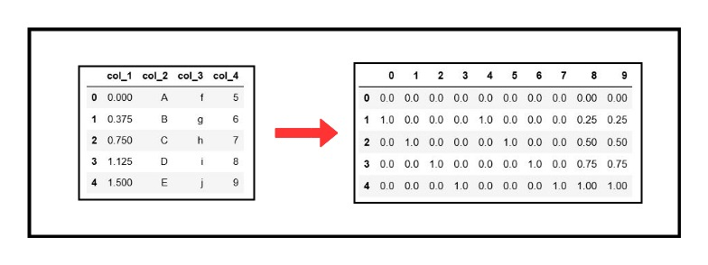

# Tutorial for scikit-learn ColumnTransformer

> _Thank you for reviewing my GitHub repository!_

`ColumnTransformer` was introduced in `scikit-learn` from version 0.20 onwards.  
The notebook file contains a quick and easy tutorial on ColumnTransformer to get you started.   
For more information, you can refer the documentation page [here](https://scikit-learn.org/stable/modules/generated/sklearn.compose.ColumnTransformer.html)
